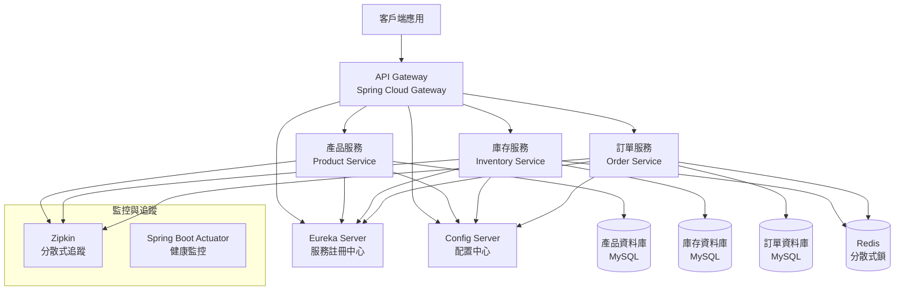
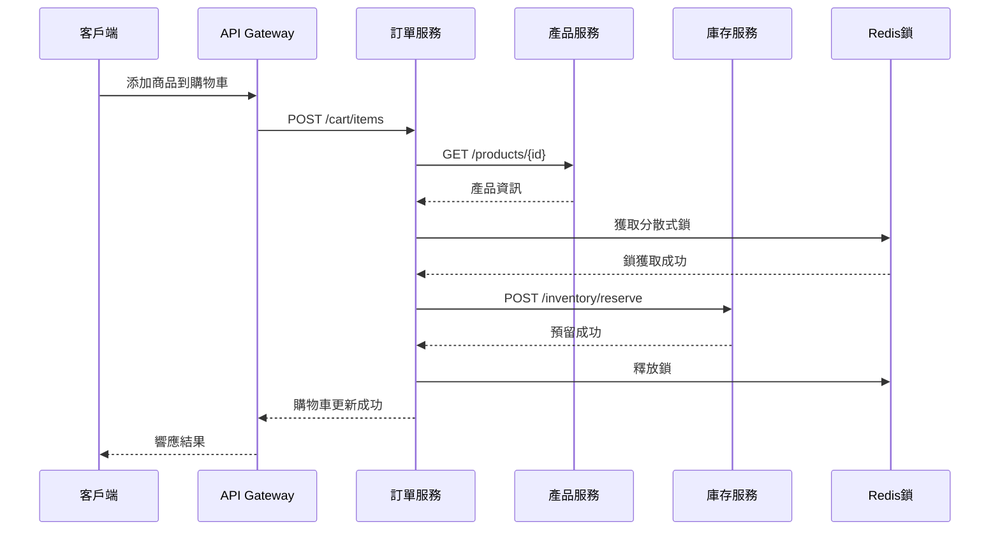

# 設計文檔

## 概述

本設計文檔描述了一個基於 Spring Cloud 的微服務系統，包含產品服務、庫存服務和訂單服務。系統採用現代微服務架構模式，支援高並發、防超賣機制，並提供完整的購物車功能。

## 架構

### 整體架構圖



### 服務通信模式



## 組件與介面

### 1. API Gateway (Spring Cloud Gateway)

**職責：**
- 統一入口點和路由
- 負載均衡
- 認證授權
- 限流和熔斷
- 分散式追蹤

**核心配置：**
```yaml
spring:
  cloud:
    gateway:
      routes:
        - id: product-service
          uri: lb://product-service
          predicates:
            - Path=/api/products/**
        - id: inventory-service
          uri: lb://inventory-service
          predicates:
            - Path=/api/inventory/**
        - id: order-service
          uri: lb://order-service
          predicates:
            - Path=/api/orders/**, /api/cart/**
```

### 2. Eureka Server (服務註冊中心)

**職責：**
- 服務註冊與發現
- 健康檢查
- 負載均衡支援

**關鍵特性：**
- 自我保護機制
- 服務實例管理
- 心跳檢測

### 3. Config Server (配置中心)

**職責：**
- 集中式配置管理
- 環境特定配置
- 動態配置更新

**配置結構：**
```
config-repo/
├── application.yml          # 通用配置
├── product-service.yml      # 產品服務配置
├── inventory-service.yml    # 庫存服務配置
├── order-service.yml        # 訂單服務配置
└── gateway.yml             # 閘道器配置
```

### 4. 產品服務 (Product Service)

**REST API 介面：**

```java
@RestController
@RequestMapping("/api/products")
public class ProductController {
    
    @GetMapping
    public ResponseEntity<Page<ProductDTO>> getProducts(Pageable pageable);
    
    @GetMapping("/{id}")
    public ResponseEntity<ProductDTO> getProduct(@PathVariable Long id);
    
    @PostMapping
    public ResponseEntity<ProductDTO> createProduct(@RequestBody CreateProductRequest request);
    
    @PutMapping("/{id}")
    public ResponseEntity<ProductDTO> updateProduct(@PathVariable Long id, @RequestBody UpdateProductRequest request);
    
    @DeleteMapping("/{id}")
    public ResponseEntity<Void> deleteProduct(@PathVariable Long id);
    
    @GetMapping("/search")
    public ResponseEntity<Page<ProductDTO>> searchProducts(@RequestParam String keyword, Pageable pageable);
}
```

**資料模型：**
```java
@Entity
@Table(name = "products")
public class Product {
    @Id
    @GeneratedValue(strategy = GenerationType.IDENTITY)
    private Long id;
    
    @Column(nullable = false)
    private String name;
    
    private String description;
    
    @Column(nullable = false)
    private BigDecimal price;
    
    private String category;
    
    @Enumerated(EnumType.STRING)
    private ProductStatus status;
    
    @Version
    private Long version;
    
    @CreationTimestamp
    private LocalDateTime createdAt;
    
    @UpdateTimestamp
    private LocalDateTime updatedAt;
}
```

### 5. 庫存服務 (Inventory Service)

**REST API 介面：**

```java
@RestController
@RequestMapping("/api/inventory")
public class InventoryController {
    
    @GetMapping("/{productId}")
    public ResponseEntity<InventoryDTO> getInventory(@PathVariable Long productId);
    
    @PostMapping("/{productId}/reserve")
    public ResponseEntity<ReservationDTO> reserveInventory(
        @PathVariable Long productId, 
        @RequestBody ReserveInventoryRequest request);
    
    @PostMapping("/{productId}/release")
    public ResponseEntity<Void> releaseInventory(
        @PathVariable Long productId, 
        @RequestBody ReleaseInventoryRequest request);
    
    @PostMapping("/{productId}/confirm")
    public ResponseEntity<Void> confirmReservation(
        @PathVariable Long productId, 
        @RequestBody ConfirmReservationRequest request);
    
    @PutMapping("/{productId}/stock")
    public ResponseEntity<InventoryDTO> updateStock(
        @PathVariable Long productId, 
        @RequestBody UpdateStockRequest request);
}
```

**資料模型：**
```java
@Entity
@Table(name = "inventory")
public class Inventory {
    @Id
    @GeneratedValue(strategy = GenerationType.IDENTITY)
    private Long id;
    
    @Column(nullable = false, unique = true)
    private Long productId;
    
    @Column(nullable = false)
    private Integer availableStock;
    
    @Column(nullable = false)
    private Integer temporaryReserved;
    
    @Column(nullable = false)
    private Integer confirmedReserved;
    
    @Column(nullable = false)
    private Integer lowStockThreshold;
    
    @Version
    private Long version;
    
    @UpdateTimestamp
    private LocalDateTime updatedAt;
}

@Entity
@Table(name = "inventory_reservations")
public class InventoryReservation {
    @Id
    @GeneratedValue(strategy = GenerationType.IDENTITY)
    private Long id;
    
    @Column(nullable = false)
    private Long productId;
    
    @Column(nullable = false)
    private String customerId;
    
    @Column(nullable = false)
    private Integer quantity;
    
    @Enumerated(EnumType.STRING)
    private ReservationType type; // TEMPORARY, CONFIRMED
    
    @Column(nullable = false)
    private LocalDateTime expiresAt;
    
    @CreationTimestamp
    private LocalDateTime createdAt;
}
```

### 6. 訂單服務 (Order Service)

**REST API 介面：**

```java
@RestController
@RequestMapping("/api/cart")
public class CartController {
    
    @PostMapping("/items")
    public ResponseEntity<CartDTO> addToCart(@RequestBody AddToCartRequest request);
    
    @PutMapping("/items/{itemId}")
    public ResponseEntity<CartDTO> updateCartItem(
        @PathVariable Long itemId, 
        @RequestBody UpdateCartItemRequest request);
    
    @DeleteMapping("/items/{itemId}")
    public ResponseEntity<CartDTO> removeFromCart(@PathVariable Long itemId);
    
    @GetMapping
    public ResponseEntity<CartDTO> getCart(@RequestParam String customerId);
    
    @DeleteMapping
    public ResponseEntity<Void> clearCart(@RequestParam String customerId);
}

@RestController
@RequestMapping("/api/orders")
public class OrderController {
    
    @PostMapping
    public ResponseEntity<OrderDTO> placeOrder(@RequestBody PlaceOrderRequest request);
    
    @GetMapping("/{orderId}")
    public ResponseEntity<OrderDTO> getOrder(@PathVariable Long orderId);
    
    @GetMapping
    public ResponseEntity<Page<OrderDTO>> getOrders(
        @RequestParam String customerId, 
        Pageable pageable);
    
    @PutMapping("/{orderId}/cancel")
    public ResponseEntity<OrderDTO> cancelOrder(@PathVariable Long orderId);
    
    @PutMapping("/{orderId}/status")
    public ResponseEntity<OrderDTO> updateOrderStatus(
        @PathVariable Long orderId, 
        @RequestBody UpdateOrderStatusRequest request);
}
```

**資料模型：**
```java
@Entity
@Table(name = "carts")
public class Cart {
    @Id
    @GeneratedValue(strategy = GenerationType.IDENTITY)
    private Long id;
    
    @Column(nullable = false, unique = true)
    private String customerId;
    
    @OneToMany(mappedBy = "cart", cascade = CascadeType.ALL, fetch = FetchType.LAZY)
    private List<CartItem> items = new ArrayList<>();
    
    @UpdateTimestamp
    private LocalDateTime updatedAt;
}

@Entity
@Table(name = "cart_items")
public class CartItem {
    @Id
    @GeneratedValue(strategy = GenerationType.IDENTITY)
    private Long id;
    
    @ManyToOne(fetch = FetchType.LAZY)
    @JoinColumn(name = "cart_id")
    private Cart cart;
    
    @Column(nullable = false)
    private Long productId;
    
    @Column(nullable = false)
    private Integer quantity;
    
    @Column(nullable = false)
    private BigDecimal unitPrice;
    
    @CreationTimestamp
    private LocalDateTime createdAt;
}

@Entity
@Table(name = "orders")
public class Order {
    @Id
    @GeneratedValue(strategy = GenerationType.IDENTITY)
    private Long id;
    
    @Column(nullable = false, unique = true)
    private String orderNumber;
    
    @Column(nullable = false)
    private String customerId;
    
    @Enumerated(EnumType.STRING)
    private OrderStatus status;
    
    @Column(nullable = false)
    private BigDecimal totalAmount;
    
    @OneToMany(mappedBy = "order", cascade = CascadeType.ALL, fetch = FetchType.LAZY)
    private List<OrderItem> items = new ArrayList<>();
    
    @CreationTimestamp
    private LocalDateTime createdAt;
    
    @UpdateTimestamp
    private LocalDateTime updatedAt;
}
```

## 資料模型

### 資料庫設計

**產品服務資料庫 (product_db):**
```sql
CREATE TABLE products (
    id BIGINT AUTO_INCREMENT PRIMARY KEY,
    name VARCHAR(255) NOT NULL,
    description TEXT,
    price DECIMAL(10,2) NOT NULL,
    category VARCHAR(100),
    status ENUM('ACTIVE', 'INACTIVE', 'DISCONTINUED') DEFAULT 'ACTIVE',
    version BIGINT DEFAULT 0,
    created_at TIMESTAMP DEFAULT CURRENT_TIMESTAMP,
    updated_at TIMESTAMP DEFAULT CURRENT_TIMESTAMP ON UPDATE CURRENT_TIMESTAMP,
    INDEX idx_category (category),
    INDEX idx_status (status)
);
```

**庫存服務資料庫 (inventory_db):**
```sql
CREATE TABLE inventory (
    id BIGINT AUTO_INCREMENT PRIMARY KEY,
    product_id BIGINT NOT NULL UNIQUE,
    available_stock INT NOT NULL DEFAULT 0,
    temporary_reserved INT NOT NULL DEFAULT 0,
    confirmed_reserved INT NOT NULL DEFAULT 0,
    low_stock_threshold INT NOT NULL DEFAULT 10,
    version BIGINT DEFAULT 0,
    updated_at TIMESTAMP DEFAULT CURRENT_TIMESTAMP ON UPDATE CURRENT_TIMESTAMP,
    INDEX idx_product_id (product_id)
);

CREATE TABLE inventory_reservations (
    id BIGINT AUTO_INCREMENT PRIMARY KEY,
    product_id BIGINT NOT NULL,
    customer_id VARCHAR(100) NOT NULL,
    quantity INT NOT NULL,
    type ENUM('TEMPORARY', 'CONFIRMED') NOT NULL,
    expires_at TIMESTAMP NOT NULL,
    created_at TIMESTAMP DEFAULT CURRENT_TIMESTAMP,
    INDEX idx_product_customer (product_id, customer_id),
    INDEX idx_expires_at (expires_at)
);
```

**訂單服務資料庫 (order_db):**
```sql
CREATE TABLE carts (
    id BIGINT AUTO_INCREMENT PRIMARY KEY,
    customer_id VARCHAR(100) NOT NULL UNIQUE,
    updated_at TIMESTAMP DEFAULT CURRENT_TIMESTAMP ON UPDATE CURRENT_TIMESTAMP,
    INDEX idx_customer_id (customer_id)
);

CREATE TABLE cart_items (
    id BIGINT AUTO_INCREMENT PRIMARY KEY,
    cart_id BIGINT NOT NULL,
    product_id BIGINT NOT NULL,
    quantity INT NOT NULL,
    unit_price DECIMAL(10,2) NOT NULL,
    created_at TIMESTAMP DEFAULT CURRENT_TIMESTAMP,
    FOREIGN KEY (cart_id) REFERENCES carts(id) ON DELETE CASCADE,
    UNIQUE KEY uk_cart_product (cart_id, product_id)
);

CREATE TABLE orders (
    id BIGINT AUTO_INCREMENT PRIMARY KEY,
    order_number VARCHAR(50) NOT NULL UNIQUE,
    customer_id VARCHAR(100) NOT NULL,
    status ENUM('PENDING', 'CONFIRMED', 'SHIPPED', 'DELIVERED', 'CANCELLED') DEFAULT 'PENDING',
    total_amount DECIMAL(10,2) NOT NULL,
    created_at TIMESTAMP DEFAULT CURRENT_TIMESTAMP,
    updated_at TIMESTAMP DEFAULT CURRENT_TIMESTAMP ON UPDATE CURRENT_TIMESTAMP,
    INDEX idx_customer_id (customer_id),
    INDEX idx_order_number (order_number),
    INDEX idx_status (status)
);

CREATE TABLE order_items (
    id BIGINT AUTO_INCREMENT PRIMARY KEY,
    order_id BIGINT NOT NULL,
    product_id BIGINT NOT NULL,
    quantity INT NOT NULL,
    unit_price DECIMAL(10,2) NOT NULL,
    total_price DECIMAL(10,2) NOT NULL,
    FOREIGN KEY (order_id) REFERENCES orders(id) ON DELETE CASCADE
);
```

### Redis 資料結構

**分散式鎖：**
```
Key: "inventory:lock:{productId}"
Value: "{lockId}:{timestamp}"
TTL: 30 seconds
```

**庫存快取：**
```
Key: "inventory:stock:{productId}"
Value: JSON格式的庫存資訊
TTL: 5 minutes
```

**購物車快取：**
```
Key: "cart:{customerId}"
Value: JSON格式的購物車資訊
TTL: 24 hours
```

## 正確性屬性

屬性是一個特徵或行為，應該在系統的所有有效執行中保持為真——本質上是關於系統應該做什麼的正式陳述。屬性作為人類可讀規範和機器可驗證正確性保證之間的橋樑。

### 購物車與訂單管理屬性

**屬性 1: 產品驗證一致性**
*對於任何* 產品ID，當添加到購物車時，只有在產品服務中存在的產品才能成功添加，不存在的產品應該被拒絕
**驗證需求: 需求 1.1**

**屬性 2: 購物車庫存同步**
*對於任何* 購物車操作（添加、修改數量、移除），庫存服務的預留數量應該與購物車中的商品數量保持一致
**驗證需求: 需求 1.2, 1.4, 1.5**

**屬性 3: 庫存不足拒絕**
*對於任何* 庫存不足的產品，添加到購物車的請求應該被拒絕並返回庫存不足錯誤
**驗證需求: 需求 1.3**

**屬性 4: 購物車查詢完整性**
*對於任何* 購物車查詢請求，返回的資料應該包含產品資訊、數量和總價等所有必要欄位
**驗證需求: 需求 1.6**

**屬性 5: 購物車到訂單轉換**
*對於任何* 有效的購物車，執行下單操作後應該創建包含相同商品的訂單，並清空原購物車
**驗證需求: 需求 1.7, 1.8**

**屬性 6: 訂單查詢完整性**
*對於任何* 訂單查詢請求，返回的資料應該包含訂單狀態、產品資訊和配送詳情等完整資訊
**驗證需求: 需求 1.9**

**屬性 7: 訂單取消補償**
*對於任何* 被取消的訂單，所有相關的庫存預留都應該被釋放回可用庫存
**驗證需求: 需求 1.10**

### 產品管理屬性

**屬性 8: 產品CRUD操作**
*對於任何* 有效的產品資料，創建和更新操作應該成功並返回包含唯一ID的產品記錄
**驗證需求: 需求 2.1, 2.2**

**屬性 9: 產品刪除約束**
*對於任何* 有關聯庫存或訂單的產品，刪除操作應該被拒絕
**驗證需求: 需求 2.3**

**屬性 10: 產品查詢完整性**
*對於任何* 產品查詢請求，返回的資料應該包含名稱、描述、價格、分類等所有必要欄位
**驗證需求: 需求 2.4**

**屬性 11: 產品狀態變更通知**
*對於任何* 產品狀態變更，相關服務應該收到通知並進行相應處理
**驗證需求: 需求 2.5**

### 庫存管理屬性

**屬性 12: 庫存創建驗證**
*對於任何* 庫存創建請求，只有在產品服務中存在的產品才能成功創建庫存記錄
**驗證需求: 需求 3.1**

**屬性 13: 庫存預留原子性**
*對於任何* 庫存預留操作，在並發情況下應該保持原子性，確保總預留數量不超過可用庫存
**驗證需求: 需求 3.2, 3.3, 3.7**

**屬性 14: 庫存不足保護**
*對於任何* 庫存不足的預留請求，應該被拒絕並返回庫存不足錯誤
**驗證需求: 需求 3.4**

**屬性 15: 庫存釋放正確性**
*對於任何* 庫存釋放操作（購物車移除、訂單取消），預留的庫存應該正確釋放回可用庫存
**驗證需求: 需求 3.6, 3.8**

**屬性 16: 庫存查詢完整性**
*對於任何* 庫存查詢請求，應該返回可用、臨時預留和正式預留的完整數量資訊
**驗證需求: 需求 3.9**

**屬性 17: 低庫存告警**
*對於任何* 總庫存水準低於閾值的產品，系統應該發出低庫存通知
**驗證需求: 需求 3.10**

**屬性 18: 過期預留清理**
*對於任何* 超過設定時間的臨時預留，系統應該自動釋放這些過期預留
**驗證需求: 需求 3.11**

### 並發控制屬性

**屬性 19: 分散式鎖互斥性**
*對於任何* 同一產品的並發庫存操作，Redis分散式鎖和資料庫樂觀鎖應該確保操作的互斥性和一致性
**驗證需求: 需求 10.1, 10.2**

**屬性 20: 重試機制**
*對於任何* 發生衝突的庫存操作，系統應該自動重試最多3次，達到上限後返回操作失敗
**驗證需求: 需求 10.3, 10.4, 3.12**

**屬性 21: 排隊機制**
*對於任何* 庫存接近售罄的熱銷產品，系統應該啟用排隊機制按先到先得原則處理請求
**驗證需求: 需求 10.5**

**屬性 22: 操作審計**
*對於任何* 庫存操作，系統應該記錄包含時間戳、用戶ID和操作類型的完整審計日誌
**驗證需求: 需求 10.6**

**屬性 23: 異常檢測保護**
*對於任何* 異常的庫存變化，系統應該觸發告警並暫停相關產品的庫存操作
**驗證需求: 需求 10.7**

**屬性 24: 鎖超時處理**
*對於任何* 分散式鎖獲取超時的情況，系統應該返回系統繁忙錯誤並建議客戶稍後重試
**驗證需求: 需求 10.8**

## 錯誤處理

### 錯誤分類與處理策略

**1. 業務邏輯錯誤**
- 產品不存在
- 庫存不足
- 訂單狀態不允許操作
- 處理方式：返回具體的業務錯誤碼和訊息

**2. 系統錯誤**
- 服務不可用
- 資料庫連接失敗
- 網路超時
- 處理方式：使用斷路器模式，提供降級服務

**3. 並發衝突錯誤**
- 樂觀鎖衝突
- 分散式鎖獲取失敗
- 處理方式：自動重試機制，達到上限後返回失敗

**4. 驗證錯誤**
- 請求參數無效
- 資料格式錯誤
- 處理方式：參數驗證，返回詳細的驗證錯誤訊息

### 斷路器配置

```yaml
resilience4j:
  circuitbreaker:
    instances:
      product-service:
        failure-rate-threshold: 50
        wait-duration-in-open-state: 30s
        sliding-window-size: 10
        minimum-number-of-calls: 5
      inventory-service:
        failure-rate-threshold: 60
        wait-duration-in-open-state: 30s
        sliding-window-size: 10
        minimum-number-of-calls: 5
```

### 重試配置

```yaml
resilience4j:
  retry:
    instances:
      inventory-operations:
        max-attempts: 3
        wait-duration: 1s
        exponential-backoff-multiplier: 2
        retry-exceptions:
          - java.util.concurrent.TimeoutException
          - org.springframework.dao.OptimisticLockingFailureException
```

## 測試策略

### 雙重測試方法

本系統採用單元測試和基於屬性的測試相結合的綜合測試策略：

**單元測試：**
- 驗證具體範例和邊界條件
- 測試服務間的整合點
- 測試錯誤條件和異常處理
- 測試特定的業務邏輯場景

**基於屬性的測試：**
- 驗證所有輸入範圍內的通用屬性
- 通過隨機化提供全面的輸入覆蓋
- 每個屬性測試最少執行100次迭代
- 每個測試必須引用其設計文檔屬性

### 測試框架選擇

**Java生態系統：**
- **JUnit 5** - 單元測試框架
- **jqwik** - Java的基於屬性測試庫
- **Testcontainers** - 整合測試的容器化依賴
- **WireMock** - 服務模擬和存根

### 屬性測試配置

每個屬性測試必須：
- 最少執行100次迭代（由於隨機化）
- 使用標籤格式引用設計屬性：**Feature: microservices-order-inventory, Property {number}: {property_text}**
- 實現智能生成器，合理約束輸入空間
- 包含失敗時的反例縮減

### 測試環境

**本地開發環境：**
```yaml
spring:
  profiles:
    active: test
  datasource:
    url: jdbc:h2:mem:testdb
  redis:
    host: localhost
    port: 6379
```

**整合測試環境：**
- 使用Testcontainers啟動MySQL、Redis容器
- 使用嵌入式Eureka Server進行服務發現測試
- 模擬外部服務依賴

### 效能測試

**負載測試場景：**
1. 高並發購物車操作（1000 TPS）
2. 熱銷產品庫存競爭（500 concurrent users）
3. 大量訂單創建（200 TPS）

**測試工具：**
- JMeter進行負載測試
- Gatling進行效能基準測試
- 自定義並發測試驗證分散式鎖效果