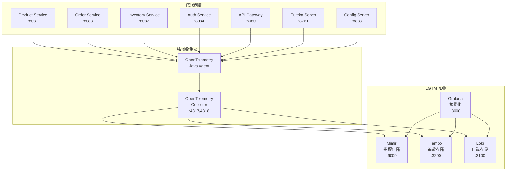

# 設計文件

## 概覽

本設計將為現有的 Spring Boot 微服務系統整合 OpenTelemetry，並建立完整的 LGTM (Loki, Grafana, Tempo, Mimir) 可觀測性堆疊。系統將使用 OpenTelemetry Java Agent 進行自動儀表化，並透過 OpenTelemetry Collector 將遙測數據路由到相應的後端存儲。

### 設計目標

1. **零程式碼變更**: 使用 OpenTelemetry Java Agent 實現自動儀表化
2. **統一可觀測性**: 整合指標、追蹤和日誌到單一堆疊
3. **高效能**: 最小化對業務邏輯的效能影響
4. **可擴展性**: 支援未來新增服務和自定義指標
5. **運維友善**: 提供豐富的儀表板和告警機制

## 架構

### 整體架構圖



### 資料流程

1. **自動儀表化**: OpenTelemetry Java Agent 自動攔截並儀表化 HTTP 請求、資料庫查詢、JVM 指標
2. **資料收集**: Agent 將遙測數據發送到 OpenTelemetry Collector
3. **資料路由**: Collector 根據資料類型將數據路由到對應的後端
4. **資料存儲**: 指標存儲在 Mimir，追蹤存儲在 Tempo，日誌存儲在 Loki
5. **資料視覺化**: Grafana 從各個後端查詢數據並提供統一的視覺化介面

## 組件和介面

### OpenTelemetry Java Agent

**職責**: 
- 自動儀表化 Spring Boot 應用程式
- 收集指標、追蹤和日誌
- 將數據發送到 OpenTelemetry Collector

**配置方式**:
- 透過 JVM 參數 `-javaagent` 附加到應用程式
- 使用環境變數進行配置
- 支援動態配置更新

**關鍵配置參數**:
```yaml
OTEL_SERVICE_NAME: 服務名稱
OTEL_EXPORTER_OTLP_ENDPOINT: Collector 端點
OTEL_RESOURCE_ATTRIBUTES: 資源屬性標籤
OTEL_TRACES_SAMPLER: 追蹤取樣策略
OTEL_METRICS_EXPORTER: 指標導出器
OTEL_LOGS_EXPORTER: 日誌導出器
```

### OpenTelemetry Collector

**職責**:
- 接收來自各個服務的遙測數據
- 處理和轉換數據格式
- 將數據路由到適當的後端存儲

**配置結構**:
```yaml
receivers:
  otlp:
    protocols:
      grpc:
        endpoint: 0.0.0.0:4317
      http:
        endpoint: 0.0.0.0:4318

processors:
  batch:
    timeout: 1s
    send_batch_size: 1024
  resource:
    attributes:
      - key: environment
        value: production
        action: upsert

exporters:
  prometheusremotewrite:
    endpoint: http://mimir:9009/api/v1/push
  otlp/tempo:
    endpoint: http://tempo:4317
    tls:
      insecure: true
  loki:
    endpoint: http://loki:3100/loki/api/v1/push

service:
  pipelines:
    metrics:
      receivers: [otlp]
      processors: [batch, resource]
      exporters: [prometheusremotewrite]
    traces:
      receivers: [otlp]
      processors: [batch, resource]
      exporters: [otlp/tempo]
    logs:
      receivers: [otlp]
      processors: [batch, resource]
      exporters: [loki]
```

### LGTM 堆疊組件

#### Mimir (指標存儲)
- **端口**: 9009
- **API**: Prometheus 相容的 Remote Write API
- **資料保留**: 可配置的保留策略
- **查詢**: PromQL 查詢語言

#### Tempo (追蹤存儲)
- **端口**: 3200
- **協議**: OpenTelemetry OTLP
- **存儲**: 本地檔案系統或物件存儲
- **查詢**: TraceQL 查詢語言

#### Loki (日誌存儲)
- **端口**: 3100
- **API**: Loki Push API
- **索引**: 基於標籤的索引策略
- **查詢**: LogQL 查詢語言

#### Grafana (視覺化)
- **端口**: 3000
- **資料源**: Mimir, Tempo, Loki
- **儀表板**: 預配置的監控儀表板
- **告警**: 基於指標的告警規則

## 資料模型

### 指標資料模型

```yaml
# JVM 指標
jvm_memory_used_bytes{area="heap", service="product-service"}
jvm_gc_collection_seconds{gc="G1 Young Generation", service="product-service"}
jvm_threads_current{service="product-service"}

# HTTP 指標
http_server_requests_seconds{method="GET", uri="/products", status="200", service="product-service"}
http_server_requests_seconds_count{method="POST", uri="/products", status="201", service="product-service"}

# 資料庫指標
db_connection_pool_active{pool="HikariCP", service="product-service"}
db_query_duration_seconds{operation="SELECT", table="products", service="product-service"}

# 自定義業務指標
business_orders_created_total{service="order-service"}
business_inventory_low_stock_items{service="inventory-service"}
```

### 追蹤資料模型

```yaml
# Span 結構
span:
  trace_id: "1234567890abcdef"
  span_id: "abcdef1234567890"
  parent_span_id: "fedcba0987654321"
  operation_name: "GET /products/{id}"
  service_name: "product-service"
  start_time: "2024-01-01T10:00:00Z"
  end_time: "2024-01-01T10:00:01Z"
  tags:
    http.method: "GET"
    http.url: "/products/123"
    http.status_code: 200
    db.statement: "SELECT * FROM products WHERE id = ?"
  logs:
    - timestamp: "2024-01-01T10:00:00.5Z"
      message: "Product found in cache"
```

### 日誌資料模型

```yaml
# 結構化日誌格式
log_entry:
  timestamp: "2024-01-01T10:00:00Z"
  level: "INFO"
  message: "Product created successfully"
  service: "product-service"
  trace_id: "1234567890abcdef"
  span_id: "abcdef1234567890"
  labels:
    environment: "production"
    version: "1.0.0"
    pod_name: "product-service-abc123"
  fields:
    user_id: "user123"
    product_id: "prod456"
    duration_ms: 150
```

## 正確性屬性

*屬性是一個特徵或行為，應該在系統的所有有效執行中保持為真 - 本質上是關於系統應該做什麼的正式陳述。屬性作為人類可讀規格和機器可驗證正確性保證之間的橋樑。*

### 屬性 1: 自動儀表化完整性
*對於任何* 微服務啟動，OpenTelemetry Agent 應該自動生成 HTTP、資料庫和 JVM 相關的指標
**驗證: 需求 1.1, 1.3, 1.4**

### 屬性 2: 追蹤資料完整性
*對於任何* 服務間請求，系統應該生成包含正確父子關係和時序的完整 trace
**驗證: 需求 1.2, 3.1, 3.3**

### 屬性 3: 指標導出可靠性
*對於任何* 產生的指標，系統應該成功將其導出到 Mimir，或在失敗時進行重試
**驗證: 需求 2.1, 2.2**

### 屬性 4: 批次處理效率
*對於任何* 大量遙測數據，系統應該使用批次方式進行導出以提高效能
**驗證: 需求 2.3**

### 屬性 5: 服務重連恢復
*對於任何* 服務重啟情況，OpenTelemetry 組件應該自動重新建立與後端的連接
**驗證: 需求 2.4**

### 屬性 6: 錯誤追蹤準確性
*對於任何* 包含錯誤的請求，相應的 span 應該正確標記錯誤狀態並發送到 Tempo
**驗證: 需求 3.2**

### 屬性 7: 取樣策略一致性
*對於任何* 配置的取樣率，系統應該按照該比例對追蹤數據進行取樣
**驗證: 需求 3.4**

### 屬性 8: 結構化日誌完整性
*對於任何* 產生的日誌，系統應該包含服務名稱、版本、環境等必要標籤並發送到 Loki
**驗證: 需求 4.1, 4.2**

### 屬性 9: 日誌追蹤關聯性
*對於任何* 在 trace 上下文中產生的日誌，應該保留 trace ID 和 span ID 的關聯資訊
**驗證: 需求 4.3**

### 屬性 10: 日誌級別過濾
*對於任何* 配置的日誌級別，系統應該只導出符合該級別或更高級別的日誌
**驗證: 需求 4.4**

### 屬性 11: 配置環境適應性
*對於任何* 環境變數配置的 LGTM 端點，系統應該使用該端點進行數據導出
**驗證: 需求 6.1, 6.2**

### 屬性 12: 配置容錯性
*對於任何* 無效的配置值，系統應該回退到預設值並記錄警告訊息
**驗證: 需求 6.3**

### 屬性 13: 動態配置響應性
*對於任何* 運行時的配置變更，系統應該在不重啟的情況下應用新配置
**驗證: 需求 6.4**

### 屬性 14: 非阻塞導出
*對於任何* 遙測數據導出失敗的情況，主要業務流程應該不受影響繼續執行
**驗證: 需求 7.3**

### 屬性 15: 自監控指標
*對於任何* OpenTelemetry 組件，系統應該產生其自身的效能和健康狀況指標
**驗證: 需求 7.4**

### 屬性 16: 安全傳輸
*對於任何* 遙測數據傳輸，系統應該使用 TLS 加密連接
**驗證: 需求 8.1**

### 屬性 17: 身份驗證一致性
*對於任何* 配置了 API 金鑰的後端連接，系統應該在所有請求中包含正確的身份驗證資訊
**驗證: 需求 8.2**

### 屬性 18: 資料隱私保護
*對於任何* 導出的遙測數據，不應該包含密碼、API 金鑰等敏感資訊
**驗證: 需求 8.3**

### 屬性 19: 資料保留策略
*對於任何* 配置的資料保留期限，系統應該自動清理超過期限的歷史數據
**驗證: 需求 8.4**

## 錯誤處理

### 連接失敗處理

1. **重試機制**: 使用指數退避策略重試失敗的連接
2. **熔斷器**: 在連續失敗達到閾值時暫停導出，避免資源浪費
3. **降級策略**: 在後端不可用時，將數據暫存到本地檔案系統
4. **告警機制**: 在連接失敗時發送告警通知

### 資料處理錯誤

1. **格式驗證**: 在導出前驗證數據格式的正確性
2. **資料清理**: 自動移除或脫敏敏感資訊
3. **批次處理**: 使用批次處理提高效率，單個失敗不影響整批
4. **死信佇列**: 將無法處理的數據發送到死信佇列進行人工處理

### 效能問題處理

1. **背壓控制**: 在下游處理能力不足時限制數據產生速率
2. **記憶體管理**: 設定記憶體使用上限，避免 OOM 錯誤
3. **取樣調整**: 根據系統負載動態調整取樣率
4. **優雅降級**: 在資源不足時優先保證核心業務功能

## 測試策略

### 單元測試

1. **配置驗證測試**: 驗證各種配置組合的正確性
2. **資料轉換測試**: 測試遙測數據的格式轉換邏輯
3. **錯誤處理測試**: 測試各種異常情況的處理邏輯
4. **效能基準測試**: 測試 OpenTelemetry 組件的效能影響

### 整合測試

1. **端到端測試**: 從服務產生數據到後端存儲的完整流程測試
2. **多服務測試**: 測試跨服務追蹤的正確性
3. **故障恢復測試**: 測試各種故障情況下的恢復能力
4. **負載測試**: 測試高負載情況下的系統穩定性

### 屬性測試

每個正確性屬性都將實現為屬性測試，使用 jqwik 框架進行隨機化測試：

- **最少 100 次迭代**: 每個屬性測試運行至少 100 次隨機化測試
- **標籤格式**: **功能: opentelemetry-lgtm-integration, 屬性 {編號}: {屬性文字}**
- **需求追溯**: 每個測試都明確標註其驗證的需求條款

### 監控和驗證

1. **健康檢查**: 實現各組件的健康檢查端點
2. **指標驗證**: 定期驗證關鍵指標的正確性
3. **資料完整性檢查**: 檢查數據在傳輸過程中的完整性
4. **效能監控**: 持續監控 OpenTelemetry 對系統效能的影響